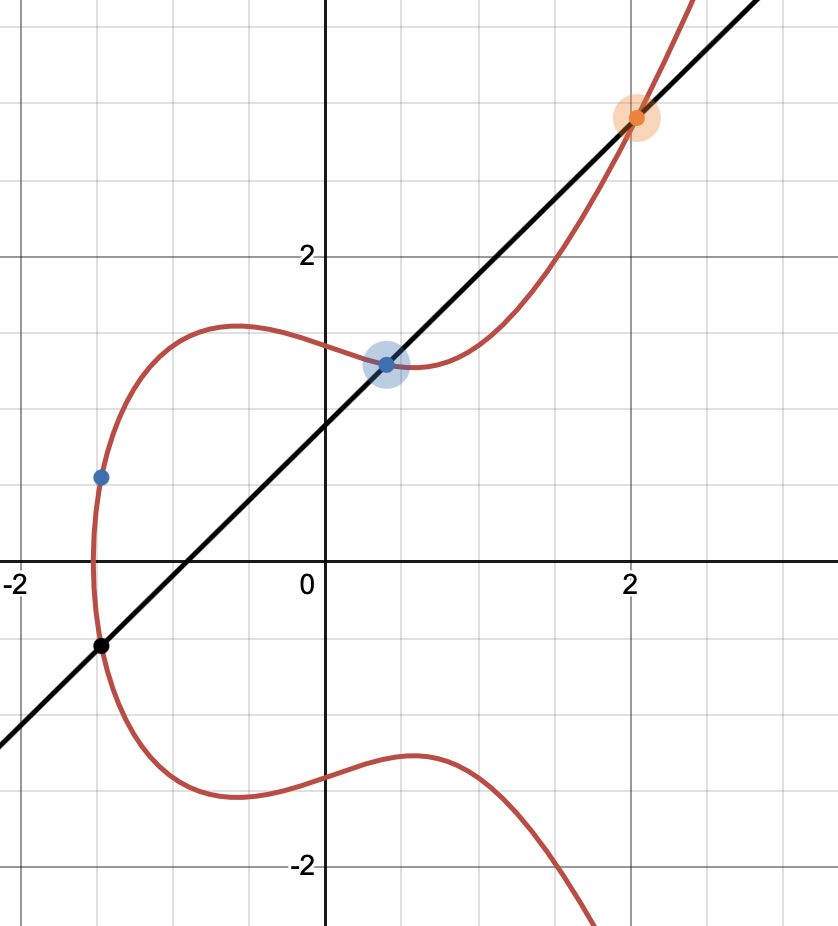

# Introduction to Elliptic Curve Cryptography
This blogpost is going to be an introduction-level post about [Eliptic Curve Cryptography (ECC)](https://en.wikipedia.org/wiki/Elliptic-curve_cryptography).  
It assumes knowledge in modular arithmetic as well as basic Group theory knowledge, both of which I have blogged about [in the past](https://github.com/yo-yo-yo-jbo/crypto_modular/).  
I will also be referring several times to my [Diffie-Hellman key exchange blogpost](https://github.com/yo-yo-yo-jbo/dh_key_exchange/).

## What is an Elliptic Curve and its use in cryptography
At the heart of Elliptic Curve Cryptography lies a fascinating mathematical object: the elliptic curve. Unlike what the name might suggest, elliptic curves have nothing to do with ellipses. Instead, they're defined by a specific type of cubic equation and possess elegant algebraic properties that make them perfect for cryptography.  
One great thing about `ECC` is its small key size requirements - a `256` bit key on an Elliptic Curve is as good as a `4096` RSA private key.

### The general equation
Over the real numbers, an elliptic curve is typically given by the *Weierstrass equation*:

$y^2=x^3+ax+b$

To ensure that the curve is smooth (i.e., it has no cusps or self-intersections), the *discriminant* must be nonzero:

$\Delta=−16(4a^3+27b^2)\neq0$

This condition ensures that the curve forms a well-behaved shape suitable for defining arithmetic.  
Here’s what an elliptic curve looks like when plotted over the real numbers with `a = -1` and `b = 2` (courtesy of [desmos.com](https://www.desmos.com)):  


Note the curve is symmetrical in relation to the `x` axis - this is because the only power of `y` in the equation is `2`.

### Point addition as a Group
Just like other curves, we could select two different points on the curve (let's call them `P` and `Q`) and connect them with a line.  
Amazingly, that line will hit that curve exactly *one* more time, unless the points have the same `x` coordinate.  
That quality gives us a strong motivation to build a mathematical `Group` out of it!  
As a reminder, a `Group` is a set of elements that have an `operation` defined on them. If we mark the operation as `+`, the requirements are:
- The operation is *closed* - for every two elements `x` and `y` the result `x+y` is also a part of the set.
- Identity element: the operation has a special element marked as `0` called *identity element* that satisfies `0+x = x+0 = x`.
- Associativity: every three elements `x`, `y` and `z` satisfy: `x+(y+z) = (x+y)+z`.
- Inverse element: for every element `x` there exists an element `y` that satisfies `x+y=0`, and we mark it as `y=-x`.

Note in my previous post about Group I marked things slightly differently - the identity was marked as `e` and the operation looked like multiplication rather than addition. However, those are just marks - you can think of them as [C++ operator overloading](https://en.cppreference.com/w/cpp/language/operators).  
In fact, from school, we got used to addition and multiplication to be *commutative*, so `x+y = y+x`. That is *not* necessarily true in Group theory, but in our case for `ECC` it will be true - we call commutative Groups [Abelian](https://en.wikipedia.org/wiki/Abelian_group).  
How far are we from saying that point addition on an Elliptic curve is a Group?  
Well, if the elements of our Group are the points on the curve, we know how to add two points to get a third, besides the following cases:
1. The points are the same point (i.e. we want to define `P+P`).
2. The points are not the same point but have the same `x` coordinate but oppositve `y` coordinates, i.e. `(x, y)` and `(x, -y)`.

Let us define those, and the entire Group!
- Because the curve is smooth ($\Delta\neq0$) each point has a tangent, and it crosses the line in exactly one more point, besides points that have `y=0` that create a perfectly vertical tangent, so besides those annoying points (there could be one or three of them), we already have `P+P` defined.
- If `P = (x, y)` it feels natural to define `-P = (x, -y)`. Connecting those two points with a line gets us nowhere... So let's define one more element in the Group! Geometrically, we won't see it, but we refer to is as *the point at Infinity* and mark it as $\mathcal{O}$. That will be our *identity element*.
- For 3 points `P`, `Q`, `R` on the same line, we define `P+Q+R` as $\mathcal{O}$, or, in other words: `P+Q = -R`. Geometrically, it means that we stretch a line between `P` and `Q`, get the third point and then take a the point "mirrored" as the result.
- Points that have a `y` coordinate of `0` (as I mentined, there could be one or three of them) are the inverse of themselves, so for those points `P = -P`, which also tells you `P+P` is just $\mathcal{O}$.

Here is how point addition looks like geometrically (again courtesy of [desmos.com](https://www.desmos.com)):



The "big" orange and blue dots represent the points `P` and `Q`, and the small *blue* point represents `P+Q`.  
Note how the Group we defined is also *Abelian* (as well as passes all requirements to be a mathematical Group).

### Using Elliptic Curves for cryptography
So, we built a group - that's nice and all, but how is it practical?  
For cryptography and computers in general, we are usually interested in *countable* numbers. I won't go into the details about what that means exactly, but in our case I'd say we simply have too many points (currently - [real numbers](https://en.wikipedia.org/wiki/Real_number)).  
Additionally, just like we saw in my [Diffie-Hellman blogpost](https://github.com/yo-yo-yo-jbo/dh_key_exchange/), things get interesting when you work `mod` some number (we used a prime in Diffie-Hellman).  
In `ECC`, we will either use a prime number or a large power of 2, but let's stick with primes for now. Thus, we will work with all integer numbers satisfying:

$y^2=x^3+ax+b (mod p)$

What different does it make?  
First of all, the number of points is finite, but most importantly - addition is done `mod p`, and therefore looks unpredictable, just like raising a number to large powers `mod p` looked unpredictable in Diffie-Hellman.  
Let's continue discussing the addition of a point to itself - we have defined `P+P`, and we can do that over and over and get new points.  
Our mathematical notation will be `P+P = 2P` and generally we could get `P+P+P+...+P = nP`. We call these *coefficient multiplication* or *scalar multiplication* of a point.  
Interestingly, that scalar multiplication is what we call a *trapdoor function* - it's relatively easy to calculate but hard to invert, and behaves very much like the [Discrete Logarithm](https://en.wikipedia.org/wiki/Discrete_logarithm) I mentioned in my [Diffie-Hellman key exchange blogpost](https://github.com/yo-yo-yo-jbo/dh_key_exchange/). In fact, this scalar multiplication reversal problem is exactly called the *Elliptic Curve Discrete Logarithm problem*!  
Formally, if we have a *base point* marked as `P` and a very large positive integer `n`, it's hard to get `n` from the points `P` and `nP`.  
In a sense, you could think of the pair `(P, nP)` as a *public key* and `n` as a *private key*, which, as I promised, even a `256`-bit private key is currently considered cryptographially safe (over the right parameters - more on that later).

### Elliptic Curve Diffie-Hellman
Similarly to [Diffie-Hellman key exchange protocol](https://github.com/yo-yo-yo-jbo/dh_key_exchange/), we an define a similar protocol over the Group we have defined.  
Let's assume `Alice` and `Bob` agree on the curve, the prime `p` and a base point `P`. Then:
1. `Alice` chooses a random large number `a` and sends `Bob` the point `aP`.
2. `Bob` chooses a random large number `b` and sends `Alice` the point `bP`.
3. `Alice` gets `Bob`'s point and multiplies it with her `a` scalar, getting `a(bP) = abP`.
4. Similarly, `Bob` gets `Alice`'s point and multiplies it with his `b` scalar, getting `b(aP) = abP`.
5. Now `Alice` and `Bob` have exchanged a secret `abP` - for example, they could use the `x` coordinate of that `abP` point.
6. Note an evesdropper is not capable of concluding `a` from `aP` or `b` from `bP`.

That is the [Elliptic Curve Diffie-Hellman (ECDH)](https://en.wikipedia.org/wiki/Elliptic-curve_Diffie–Hellman) key exchange algorithm, but there are other algorithms that rely on the same scalar multiplication reversal problem, most notably is the [Elliptive Curve Digital Signature Algorithm (ECDSA)](https://en.wikipedia.org/wiki/Elliptic_Curve_Digital_Signature_Algorithm) that I might be covering some other time.

## Potential attacks on Elliptic Curve Cryptography
The summary so far might think every curve and point are good - but just like in RSA or Diffie-Hellman, choosing bad parameters can cause substantial weaknesses to the entire cipher.  
The parameters chosen for `ECC` are known as *Domain Parameters*, and similarly to the "vanilla" Diffie-Hellman, are standarized.  
Some notes about the Domain Parameters:
- We work in a finite field with a size that is typially a large prime `p` or a large power of `2`.
- We define a special base point for a given curve and note it as `G`, which is the *generator* of a subgroup of points in the curve, similarly to what we had in Diffie-Hellman. That `G` has to have an *order* of a large number (that order is the smallest number `k` such that `kG` is $\mathcal{O}$), and usually a prime.

There are other complicated requirements on the Domain Parameters (including choosing the right values `a` and `b` for the curve!) that counter certain attacks against `ECC`, but we won't be talking about them (mostly because I am not familir with all of them!) - the important take is that you should only use Domain Parameters that are believed to be safe.  
With that in mind, I'd like to talk about certain attacks on `ECC`:

### Side-channel attacks
Practically all `ECC` implementations require scalar multiplication - calculating `nP` for a point `P`.  
If done naively, measuring the time or power consumption could be a great target for a [Side-channel-attack](https://en.wikipedia.org/wiki/Side-channel_attack).  
When I say "naive implementation" I do not mean iteratively adding a point to itself `n` times - that would take too much time if `n` is a `256`-bit integer!  
Rather than that, assuming the primitive we'll call `double_point` which calculates `P --> 2P`, we can look at the binary representation of `n` and use its bits.  
For example, if `n` is `13` (I chose a small number just for demonstration purposes!), then `n` is `1101` in binary, or, in other words: $13 = 2^3 + 2^2 + 2^0$.  
We multiply points again and again based on the binary position of the power of 2: `13P = 2*2*2*P + 2*2*P + P`.  
So a naive implementation of scalar multiplication might look like this:

```python
def scalar_mult(P, n):
    """
        Naively calculates nP - do not use this in a real implementation.
    """

    Q = INFINITY_POINT      # Assuming a point at infinity is saved in a constant

    # Iterate powers of 2
    pw = 0
    while n > 0:
        if n & 1:
            tmp = P
            for i in range(pw):
                tmp = double_point(tmp)
            Q += P

    return Q
```

In the case of `ECDH` we have described earlier, if it takes `10` miliseconds for `Alice` to run `double_point`, and it took her `50` miliseconds in total, then we can conclude she had to double points around `50/10 = 5` times. This reveals a lot about `n` and might even allow an attacker to cleverly perform a bruteforce attack on `n` - not good!  
There are several ways to combat that, the most known one is known as a *Montgomery Ladder* and is just simple and elegant:

```python
def scalar_mult(P, n):
    """
        Montgomery ladder - naive approach.
    """

    R0 = INFINITY_POINT
    R1 = P

    # Working from MSB to LSB
    for bit in range(256, -1, -1):
        if n & (1 << (bit)):    # If that bit is set
            R0 += R1
            R1 = double_point(R1)
        else:                  # If that bit if not set
            R1 += R0
            R0 = double_point(R0)
```

This implementation does scalation multiplication in a constant time (assuming `double_point` and general point addition do not reveal information about the points involved).

### CVE-2020-0601 ("CurveBall")
Back in 2020, a new vulnerability was reported (interestingly by the NSA) - it got the CVE assignment of [CVE-2020-0601](https://cve.mitre.org/cgi-bin/cvename.cgi?name=CVE-2020-0601) and was later nicknamed "CurveBall" due to its relation to Elliptic Curves.  
Apparently, the Windows CryptoAPI supported digital signatures based on `ECC` that could come in two different forms: either a well-known [named curve](https://learn.microsoft.com/en-us/windows/win32/seccng/cng-named-elliptic-curves), or - *by supplying the curve parameters*.  
As I warned earlier in this blogpost, you cannot just choose any Domain Parameters and "hope for the best", and that is exactly what happened!  
The practical scenario affected public keys in certificates, as well as file's digital signatures, and in fact - an attacker could completely control:
- The finite field (the `p` in `mod p`)
- The curve itself (the `a` and `b` parameters in the Weierstrass form)
- The base point `P` on the curve
- The order of the base point
- Another parameter called *cofactor* which represents the ratio between the Group order and the finite field size

Let's assume a public key that Windows trusts - it's a point `Q` which is expected to be `Q=nP`.  
However, since the attacker controls the base point `P`, they could, for instance, set `P` as `Q` and know the private key - `n=1`!  
That vulnerability had a deep impact on Microsoft and the world in general, but was easy to spot when examining TLS traffic or certificate files on disk.  
What an impactful vulnerability!

### The case of Dual_EC_DRBG
If the CurveBall case showed the NSA responsibly dislosing a vulnerability, the case of [Dual_EC_DRBG](https://en.wikipedia.org/wiki/Dual_EC_DRBG) is the opposite - it's an *introduction* of a mathematical backdoor.  
As we have seen, secure random number generation is essential to many cryptographic applications.  
Well, in 2006, a new [Crypgoraphically Secure Pseudo-Random Number Generator (CSPRNG)](https://en.wikipedia.org/wiki/Cryptographically_secure_pseudorandom_number_generator) known as *Dual_EC_DRBG* was proposed to be standarized.  
As we mentioned before, point multiplication on an Elliptic Curve in a finite field is "unexpected", so it makes sense to use Elliptic Curves for pseudo-random number generation. Let's see how the proposal looked like mathematically.  
The algorithm has the following parameters:
- An Elliptic Curve `E` over a finite field
- A base point `P` with a large order `n`.
- Another point on the curve `Q`.

Given a secret internal state `s`, the algorithm iterates as such:
- The next value of `s` is the `x` coordinate of `sP`.
- The output `r` of the iteration is the truncated `x` coordinate of `sQ`.

Immidiately, the implementation drew attention. Firstly, it's not clear why truncation is necessary - introducing more randomness to a *CSPRNG* is a desired thing. More importantly though, the relation between points `Q` and `P` was unclear.  
Let's assume someone malevolent proposed some two points `Q` and `P`, but in secret built them as such: `Q = dP` for some *secret* scalar `d` that only they knew.  
This compromises the security of the entire system!  
Given the output `r` at some iteration, assuming the truncation wasn't too aggressive, one could brute-force possible `x` coodinates, getting candidates of `sQ`.  Then, one might recover the output `r` at that iteration by calculating: $d^{-1}(sQ) = d^{-1}(sdP) = sP$, thus concluding the next secret state of `s`!  
Note that once one knows `s`, all future pseudo-random values can be determined, thus, the entire *CSPRNG* is compromised - neat, and scary!  
Luckily, `Dual_EC_DRBG` is not used anywhere these days (I hope!), but it's important to always doubt the Domain Parameters of curves.

## Summary
In this blogpost, we have introduced a lot of math, cryptography and even mentioned attacks and vulnerabilities related to `ECC`.  
There are entire books and very deep theory about Elliptic Curves, most of whih I am not familiar with, but I hope this blogpost gave a nice taste of `ECC`, its usefulness and some of its pitfalls.

Stay tuned!

Jonathan Bar Or
