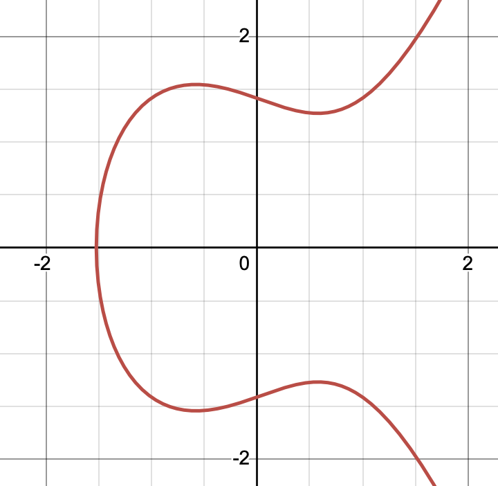

# Introduction to Elliptic Curve Cryptography
This blogpost is going to be an introduction-level post about [Eliptic Curve Cryptography (ECC)](https://en.wikipedia.org/wiki/Elliptic-curve_cryptography).  
It assumes knowledge in modular arithmetic as well as basic Group theory knowledge, both of which I have blogged about [in the past](https://github.com/yo-yo-yo-jbo/crypto_modular/).  

## What is an Elliptic Curve?
At the heart of elliptic curve cryptography lies a fascinating mathematical object: the elliptic curve. Unlike what the name might suggest, elliptic curves have nothing to do with ellipses. Instead, they're defined by a specific type of cubic equation and possess elegant algebraic properties that make them perfect for cryptography.

### The general equation
Over the real numbers, an elliptic curve is typically given by the *Weierstrass equation*:

$y^2=x^3+ax+b$

To ensure that the curve is smooth (i.e., it has no cusps or self-intersections), the *discriminant* must be nonzero:

$\Delta=−16(4a^3+27b^2)\neq0$

This condition ensures that the curve forms a well-behaved shape suitable for defining arithmetic.  
Here’s what an elliptic curve looks like when plotted over the real numbers with `a = -1` and `b = 2`:  

### Point addition
